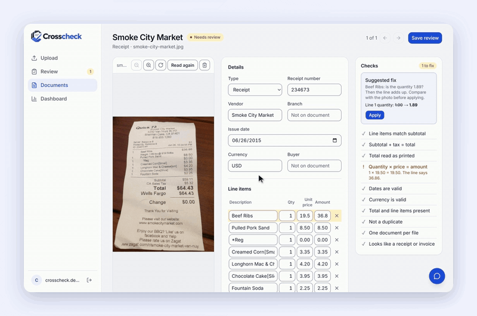
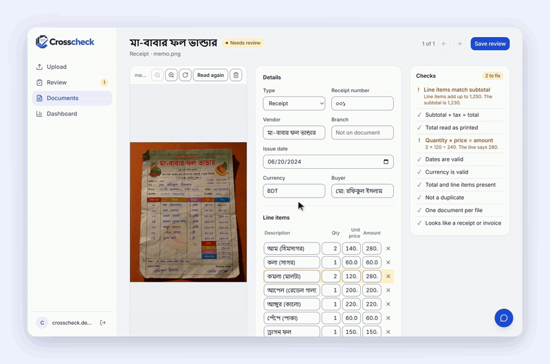

<p align="center">
  <picture>
    <source media="(prefers-color-scheme: dark)" srcset="assets/logo-dark.png">
    
  </picture>
</p>

<p align="center">
  <b>Receipts and invoices read by AI, then checked by plain code.</b><br>
  Upload a batch, get checked spreadsheet rows, and look only at the documents the checks flag.
</p>

<p align="center">
  <a href="https://github.com/07fahim/ai-receipt-invoice-extractor/actions/workflows/ci.yml"></a>
  <a href="https://crosscheck-gamma.vercel.app"></a>
</p>

<p align="center">
  <a href="https://crosscheck-gamma.vercel.app">Live demo</a> ·
  <a href="#how-it-works">How it works</a> ·
  <a href="#measured-results">Measured results</a> ·
  <a href="#run-it-locally">Run it locally</a>
</p>



Recorded on an earlier version of the reader.

> **Try it:** sign up on the [live demo](https://crosscheck-gamma.vercel.app) and use the sample receipts. The free
> server sleeps when idle, so the first request can take about a minute.

## Highlights

- **91% and 94% of receipts read fully correct** on the CORD-v2 test and validation sets, and only 2 in 100 were
  wrong without a check catching it.
- **Checks you can read:** every sum, tax line, date and duplicate is checked by plain Python, so a flag always says
  exactly what failed and why.
- **One click to fix:** the review screen suggests the likely fix (for example a thousands separator read as a
  decimal point, or a weighed item read as quantity 1), and nothing changes without the user's click.
- **An assistant for your documents:** ask in English or Bangla about spending, due bills or why a receipt was flagged. It answers from your own data through read-only lookups, so it never changes a document. 25 of 26 test questions answered right.
- **A second reading** by another model on flagged documents (and passed ones while free quota is left), offered
  field by field. On a crumpled handwritten Bangla memo it found the misread date and one of the two misread amounts.
- **97% read right on 396 international receipts** (WildReceipt), after checking every difference against the image;
  every real error was flagged.
- **Fits into existing tools:** CSV, Excel and QuickBooks exports, plus signed webhooks to n8n (Google Sheets,
  Telegram, email) or the user's own address.



## What it does

- **Reads** receipts and invoices (JPG, PNG, WebP, HEIC, PDF; up to 20 files at a time) with a vision model:
  vendor, branch, buyer, number, dates, currency, line items, subtotal, tax, service charge, discount and total.
- **Checks** every reading with plain code: line items against the subtotal, subtotal + tax + service − discount
  against the total, quantity × price, dates, currency, thousands read as decimals, duplicates, files with
  several documents, and files that are not receipts at all.
- **Sends to review** only what failed a check. The review screen shows the original next to the fields, explains
  each failed check and can suggest a fix (never applied without a click). A date like 05/11/2021 is asked about,
  and the answer can be kept for every document from that vendor.
- **Exports** CSV and Excel (every document read, with its status) and a QuickBooks bill import file (checked
  documents only). A dashboard shows spending and tax per currency
  (amounts are never converted).
- **Sends events** (`document.passed`, `needs_review`, `reviewed`, `failed`, `deleted`) to a webhook. The included
  n8n workflow writes each checked document to a Google Sheet and sends Telegram and email alerts for the ones that need
  review. Users can also add their own webhook address on the Account page.
- **Accounts:** email or Google sign-in. Every document belongs to one user. Users can delete documents (one or many at once) or their
  whole account.
- **Second reading** of flagged documents, and passed ones while quota is left, by another model. Offered field by
  field in the review screen; a passed document moves to review when the second reading differs on money, dates,
  line amounts or the vendor. Nothing changes until the user picks a value.
- **Assistant:** a chat window on every app page answers questions about the user's own documents in English or Bangla (Bangla questions get Bangla check messages). The model is Gemini 3.5 Flash-Lite, with Qwen on Groq and then OpenRouter as fallbacks. It uses five read-only lookups, each limited to the signed-in user's documents. Chats are kept until the user deletes them, and there are daily message limits per user and for the whole app. Measured results: [results/ASSISTANT_NOTES.md](results/ASSISTANT_NOTES.md).

## How it works

<p align="center">
  
</p>

## Measured results

Gemini 3.1 Flash-Lite, temperature 0, prompt version `be0376e0`, measured 2026-09-30. The result files are in
[`results/`](results), with notes in [`results/M3_NOTES.md`](results/M3_NOTES.md).

The app now runs prompt `a19decf8`, which adds two rules: coupon and discount lines are never items, and lines that
add up other lines (a subtotal) are never items. It was measured on 117 WildReceipt receipts (the flagged wrong ones,
and the right ones with a discount, coupon or savings line) and on 17 Bangladeshi samples. On those, real errors went
from 12 to 5, all still flagged. The other WildReceipt receipts, CORD and the invoices were not re-run, so the table
below is from `be0376e0`.

| Set | Documents | Fully correct | Total amount correct | Wrong and not flagged | Correct but sent to review |
|---|---|---|---|---|---|
| CORD receipts, test | 100 | 91% | 93.8% | 2 | 5 of 91 |
| CORD receipts, validation | 100 | 94% | 96.9% | 2 | 5 of 94 |
| Invoices, test | 26 | 77% | 96.2% | 2 | 6 of 20 |
| Invoices, validation | 48 | 64.6% | 100% | 3 | 8 of 31 |
| WildReceipt receipts, test | 396 | 81.3% (97.0% checked) | 98.2% | 36 (0 real errors) | 104 of 322 |

- **Fully correct** means every scored field is right (totals, tax, line items; on invoices also number, vendor,
  buyer, currency and dates). **Wrong and not flagged** means no check fired. That is the number that matters most,
  because those errors would reach the spreadsheet unseen.
- On invoices, most of the misses are dates like 05/11/2021 that can be read two ways (4 of the 6 wrong test
  invoices, 14 of the 17 wrong validation invoices). Every one of them was flagged. That is by design: the check
  fires on any printed date that can be read both ways. With the vendor's date order applied, which is what
  confirming it once in the review screen does, the dates were 100% right. The same rule also sends correctly read
  ambiguous dates to review: every invoice false alarm in the table is one of these.
- The unflagged invoices (2 on test, 3 on validation) are all answer-key errors: checked against the images, the
  model was right. Of the 4 unflagged CORD receipts, 2 are answer-key errors and 2 have the totals right and an
  error in a line item.
- WildReceipt is an international receipt set (US, UK, Europe, Malaysia, India, the Gulf and more), measured
  2026-10-03. The prompt and checks were not changed for it; the label converter was fixed on it. Scored: total,
  subtotal, tax and item amounts. Its answer keys often differ from our format, so all 74 differences were checked
  against the images. 12 are real model errors: 2 misread numbers and 10 coupon or discount lines listed as items.
  The checks flagged all 12. The other 62 are answer-key errors, fuel receipts that label the price per gallon as the
  item price, receipts with no line called "Subtotal", discounts and zero lines written differently, and rounding or
  a tip. That leaves 384 of 396 (97.0%) read right and no error unflagged. Its licence is unclear, so only these numbers are published.

**Planted mistakes.** Each correct answer key was copied once per mistake type, with one realistic mistake planted
in each copy (a misread digit, a dropped or doubled line, cash paid taken as the total, a missed tax line, and so
on). Then the checks were run on every copy. No model calls are involved.

| Set | Mistakes planted | Caught |
|---|---|---|
| CORD receipts, test / validation | 596 / 580 | 93.0% / 94.5% |
| Invoices, test / validation | 175 / 336 | 98.9% / 95.8% |

The weak spot is one misread digit in a CORD total (66% and 73% caught), mostly on receipts that print no subtotal.

**Other measurements**
- **Same input, same answer** (earlier prompt `9edae16b`): 30 US receipt photos read 3 times gave identical answers
  every time.
- **Damaged photos** (earlier prompt `9edae16b`, 26 test invoices): a smaller, blurred, darker JPEG read as well as
  the clean one. At 640 px wide with heavy blur, fully correct dropped from 69% to 35%, and 2 new errors went
  unflagged.
- **Speed:** about 6 seconds per document (median 5.9 to 6.8 s across the four sets).
- **Cost:** about $0.0009 per receipt and $0.0013 per invoice at Gemini 3.1 Flash-Lite's list prices
  ($0.25 in / $1.50 out per million tokens, read 2026-09-28), worked out from the median token counts. The runs
  themselves used the free tier, so this is an estimate and not a measured bill.

**Why two models.** Gemini 3.1 Flash-Lite reads every document: it was the most accurate model in a 10-receipt
trial (9 of 10) and answers in about 5 seconds within the free quota. Gemini 3.5 Flash with thinking set
to low is more careful on hard images, but it is slower and its free daily quota is small. So it only rereads
documents that fail a check, plus passed ones from leftover quota (15 a day for the whole app, 5 per user). On the
17 Bangladeshi sample images, the first reading failed a check on 5:
- The same fruit-shop memo comes in three versions: printed, handwritten, and a real photo of the handwritten one.
  On the printed and handwritten versions, the second reading read a line amount as 240 where the first read 280,
  and every check passed. The memo says 240.
- On the real photo it corrected the date and one line amount (both checked against the photo). One line is still
  misread, so the document stays flagged.
- On a tax invoice and a utility bill it changed the discount and the total. These are not yet checked against the
  images.

It is not always right: on one bill that had passed, its own answer failed a check. That is why its values are only
offered field by field and nothing changes until the user picks one. Details in
[`results/M3_NOTES.md`](results/M3_NOTES.md).

**Data and how it was used.** [CORD-v2](https://huggingface.co/datasets/naver-clova-ix/cord-v2) (CC BY 4.0,
Indonesian receipts) and [katanaml invoices](https://huggingface.co/datasets/katanaml-org/invoices-donut-data-v1)
(synthetic English invoices, tagged MIT). Prompt changes were tried on training samples first. CORD test and a few
CORD validation receipts were also used to find problems (thousands separators, a discount counted twice), so
neither CORD split is fully unseen. The first invoice run looked at both invoice splits, so neither is unseen for
the date fix either. The receipt in the screenshot and two of the demo samples come from the ExpressExpense US
receipt set (CC0); the third sample is a synthetic Dhaka bill.

## Tech stack

| Part | Built with |
|---|---|
| Web app | Next.js 16, TypeScript, Tailwind CSS, shadcn/ui, Recharts |
| API | Python 3.11, FastAPI, Pydantic |
| AI | Gemini 3.1 Flash-Lite (vision), one image per call, temperature 0; Gemini 3.5 Flash (thinking low) for second readings; Gemini 3.5 Flash-Lite for the assistant, with Qwen on Groq and OpenRouter as fallbacks |
| Data and sign-in | PostgreSQL and Auth on Supabase |
| Automation | n8n (Google Sheets, Telegram, Gmail), signed webhooks |
| Hosting and CI | Vercel, Render, GitHub Actions |

## Run it locally

You need Python 3.11, Node 24 and a Postgres database. The project uses Supabase for both the database and sign-in.

1. API settings: a `.env` file in the repo root.

   | Setting | What it is |
   |---|---|
   | `GEMINI_API_KEY` | Google AI Studio key |
   | `DATABASE_URL` | Postgres connection string (Supabase session pooler, port 5432) |
   | `SUPABASE_URL` | Your Supabase project address; sign-in tokens are checked with its public keys |
   | `SUPABASE_SECRET_KEY` | Optional. Lets users delete their account |
   | `FRONTEND_ORIGIN` | The web app address(es), comma-separated. Default `http://localhost:3000` |
   | `DAILY_UPLOAD_LIMIT` | Model reads per user in any 24 hours. Default 10 |
   | `EXTRACT_MODEL` | Optional. Default `gemini-3.1-flash-lite` |
   | `SECOND_MODEL` | Optional. Reads flagged documents a second time, and passed ones from leftover quota. Default `gemini-3.5-flash` (thinking low) |
   | `SECOND_READ_DAILY_LIMIT` | Optional. Second readings for the whole app in any 24 hours. Default 15 |
   | `SECOND_READ_PER_USER` | Optional. Second readings per user in any 24 hours. Default 5 |
   | `GROQ_API_KEY` | Optional. Assistant fallback when Gemini is busy (Qwen on Groq) |
   | `OPENROUTER_API_KEY` | Optional. Second assistant fallback (`openrouter/free`) |
   | `ASSISTANT_PER_USER` | Optional. Assistant messages per user in any 24 hours. Default 30 |
   | `ASSISTANT_DAILY_LIMIT` | Optional. Assistant messages for the whole app in any 24 hours. Default 40 |
   | `APP_SCHEMA` | Optional. Database schema for the app's tables. Default `app` |
   | `WEBHOOK_KEY` | Optional. Any long random text; turns on users' own webhooks and encrypts their addresses |
   | `WEBHOOK_URL`, `WEBHOOK_SECRET`, `WEBHOOK_USER_ID` | Optional. Your own n8n webhook and the account(s) whose documents go there |

2. Web settings: copy `web/.env.example` to `web/.env.local` and fill in `NEXT_PUBLIC_SUPABASE_URL`,
   `NEXT_PUBLIC_SUPABASE_PUBLISHABLE_KEY` and `NEXT_PUBLIC_API_URL` (`http://localhost:8000`).

3. In Supabase: turn on email sign-up (and Google if you want it) and add `http://localhost:3000/**` to the
   redirect URLs.

4. Start both:

   ```bash
   python -m venv .venv
   .venv/Scripts/pip install -r requirements.txt      # .venv/bin/pip on macOS and Linux
   .venv/Scripts/python -m uvicorn app:app --port 8000

   # in a second terminal
   cd web
   npm ci
   npm run dev
   ```

   The API creates its tables on first start. Open http://localhost:3000.

## Run it in your own accounts

Everything runs on accounts you own: your Gemini key, your Supabase project, your Render and Vercel. Your data stays
in your own Supabase project, images go only to Google's Gemini API under your key, and the bills are yours. Assistant questions (text, never
images) also go to Gemini, or to Groq or OpenRouter if you add those keys.

- **API and n8n:** [`render.yaml`](render.yaml) is a Render Blueprint for both services. Fill in the settings Render
  asks for. It creates `WEBHOOK_KEY` itself.
- **Web app:** import the repo in Vercel with `web` as the root directory and the three `NEXT_PUBLIC_` settings.
- **n8n:** see [`n8n/README.md`](n8n/README.md) for the Google Sheets, Telegram and email workflow.

## Webhook events

Each event is a JSON POST with an `X-Signature` header: `sha256=` followed by the HMAC-SHA256 of the raw body,
keyed with your secret. For your own address that secret is shown once, when you save the address on the Account
page. For the server's n8n it is `WEBHOOK_SECRET`.

```jsonc
{
  "event": "document.needs_review",
  "id": 41,
  "file_name": "taco-bell.jpg",
  "status": "needs_review",
  "document": {"vendor": "Taco Bell", "issue_date": "2016-09-01", "currency": "USD", "total": "7.61", "items": [ /* ... */ ]},
  "checks": [{"check": "date_ambiguous", "fields": ["issue_date"], "message": "Is 9/1/2016 day first or month first?"}],
  "error": null,
  "event_id": 57
}
```
`document` holds every field read (shortened here). Amounts are strings, so no precision is lost.

Check the signature before trusting the body:

```python
import hashlib
import hmac

def from_crosscheck(body: bytes, signature: str, secret: str) -> bool:
    expected = 'sha256=' + hmac.new(secret.encode(), body, hashlib.sha256).hexdigest()
    return hmac.compare_digest(expected, signature)
```

A send can be repeated after a timeout, so use `event_id` to ignore repeats. `document.deleted` is sent only for
checked documents and carries just `id` and `status` (plus `event` and `event_id`). The Account page's "Send test"
posts `{"event": "test", "id": null}` to your own saved address.

## Tests

```bash
python test_validate.py   # the checks and fix suggestions
python test_extract.py    # parsing the model's answers
python test_app.py        # the API end to end, with a fake model and a temporary database schema
cd web && npm run lint && npm run build
```

Each Python test prints `ok`. GitHub Actions runs them on every push, with a throwaway Postgres.
`test_eval_ocr.py` needs the datasets in `data/` and runs locally only.

## Known limits

- Checks can pass on a wrong reading. A wrong name or invoice number has no arithmetic to check, and two misread
  lines can cancel out. "Passed" means the numbers agree with each other. A second reading catches some of these,
  but only while its quota lasts.
- Second readings are capped (15 a day for the whole app, 5 per user, 5 always kept for flagged documents) to stay
  inside the free quota. Past the cap, documents go to normal review without one.
- The demo uses Gemini's free tier. On it, Google may use uploaded files to improve its models, so the demo asks for
  sample receipts only.
- The API assumes one process. Running several would need the background jobs to claim their rows first.

## Privacy

What is stored, where, and who sees it: https://crosscheck-gamma.vercel.app/privacy

## Licence

All rights reserved. The code is public to read and evaluate; reuse needs written permission. See [LICENSE](LICENSE).

## Author

Built by [Fahim Faiyaz](https://github.com/07fahim), ML engineer. I build document AI and automations for small
businesses. If you want this running on your own accounts, or a version for your documents, open an issue or reach
me through GitHub.
